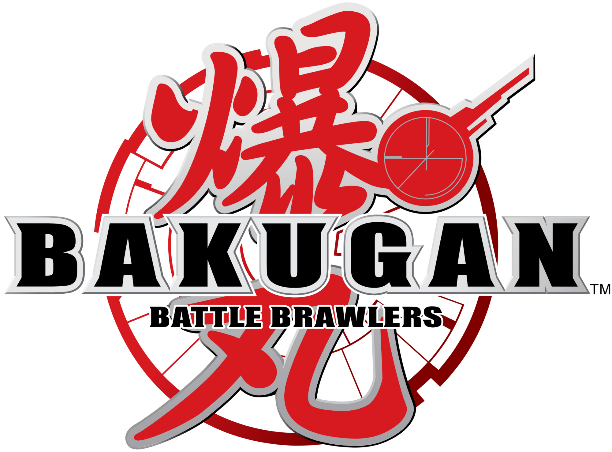

<div align="center">




     
<p>A fan-made companion app for real-life Bakugan players and game Masters, heavily inspired by the game.</p>


</div>

<br>

<p align="center">
  
</p>

Bakugan Companion is a tool for players and Game Masters who play Bakugan
in real life. It combines a collection tracker with a complete match and
battle assistant, keeping the calculations and match state under control
so everyone can focus on the game.

<p align="center">
  
</p>


Keep track of the Bakugan and cards in your physical collection.
Browse them by attribute, type, and variant.

<p align="center">
  <!-- Replace with: docs/screenshots/bakugan-inventory.png -->
  
  <!-- Replace with: docs/screenshots/card-inventory.png -->
  
</p>


Prepare a complete match before playing: choose the format, players,
teams, and Bakugan taking part in the battle.

<p align="center">
  <!-- Replace with: docs/screenshots/match-setup.png -->
  
  <!-- Replace with: docs/screenshots/one-vs-one.png -->
  
</p>


Run 1 vs 1 and team battles without reaching for a calculator. The app
tracks the battle state and handles power changes, bonuses, abilities,
and swaps as the action unfolds. It also has a music playlist with all the original game soundtrack.

<p align="center">
  <!-- Replace with: docs/screenshots/battle-arena.png -->
  
  <!-- Replace with: docs/screenshots/team-battle.png -->
  
</p>


Organize your games into seasons and follow player progression with an
ELO rating system.

<p align="center">
  <!-- Replace with: docs/screenshots/seasons-elo.png -->
  
</p>


Review previous matches, results, players, and battle details so every
session becomes part of your play history.

<p align="center">
  <!-- Replace with: docs/screenshots/match-history.png -->
  
</p>


Back up and restore saved matches so tournament and campaign data stays
safe across devices or installations.

<p align="center">
  <!-- Replace with: docs/screenshots/backup.png -->
  
</p>


3D Models thanks to MrZangestsu and sprites thanks to Jeppa <3.
Built with Flutter and made for the Bakugan community.

## Do you want to build it yourself?

### Requirements

- Flutter SDK 3.x or newer
- A supported Flutter development environment

### Run locally

```bash
flutter pub get
flutter run
```

## Project status

Bakugan Companion is an evolving project. New game modes, more customizability, more cards effects and bakugan are in the way.

Check releases for more updates.
